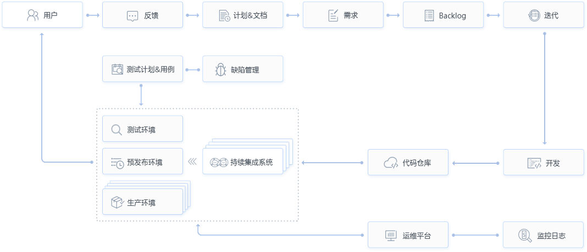

# TAPD简介

* TAPD是Tencent Agile Product Development的缩写，即腾讯敏捷产品研发，是敏捷研发方法在腾讯的具体实践。

* TAPD平台（腾讯敏捷产品研发平台），通过提炼主流敏捷产品研发模式和方法论的精髓，结合腾讯互联网产品研发的特色，以反馈-需求-迭代-发布为主线形成闭环，融合社区化理念和兴奋协作的敏捷文化，帮助产品团队敏捷迭代、小步快跑，进行产品规划、项目管理和质量跟踪等研发工作提升项目过程和资源状态的可见性，满足不同团队的差异化和灵活自适应，从而帮助团队更好更快完成产品交付并发布上线运营。

* TAPD DevOps解决方案，专为DevOps持续交付场景打造，深度整合代码管理、编译构建、部署发布各环节研发工具链，助力团队高效、可靠地构建与发布产品，快速交付用户价值。
